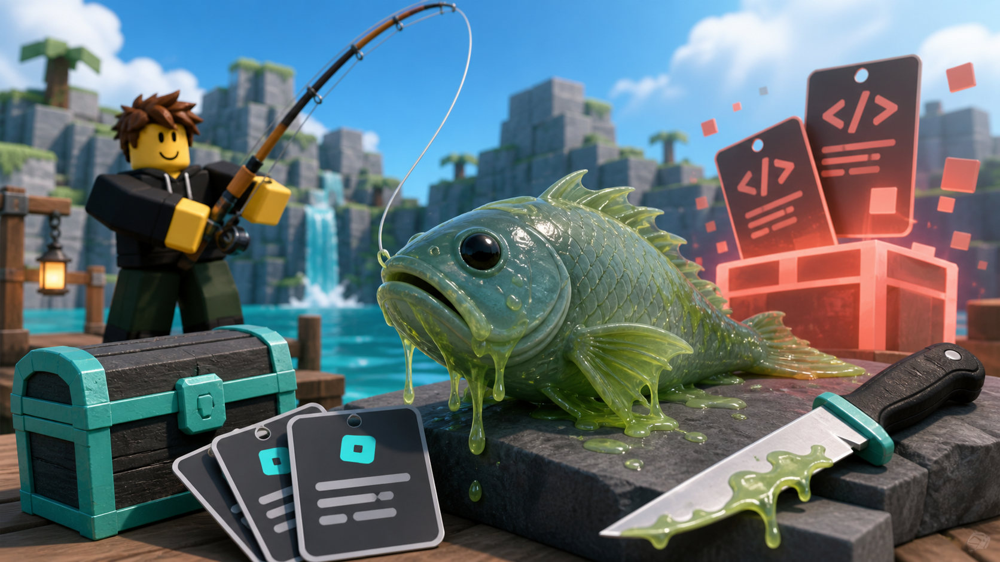

# Scale Slimy Fish E-E-A-T SEO Draft

## 目标

这篇文章面向搜索“Scale Slimy Fish codes / Scale Slimy Fish redeem codes / Scale Slimy Fish Roblox codes”的用户，核心任务不是堆词，而是建立可验证的信任感。

我们要做到：

- 只写已经被官方 Roblox 描述支持的代码
- 明确说明哪些信息已验证，哪些信息暂不可证
- 给出最短、最安全的兑换路径
- 避免把 reward、兑换成功、过期状态写成未证实事实

## 发布前计划

1. 先保留现有代码页作为主承接页，不单独制造重复页面。
2. 在主代码页补充一段“为什么这些代码可信”的说明。
3. 在游戏页和指南页之间建立内部链接，增强主题集群的一致性。
4. 用官方来源日期标注核验时间，减少过期内容风险。
5. 只有在再次确认官方描述或游戏内兑换结果后，才更新 reward 或状态。

## 建议页面定位

- 主关键词：`Scale Slimy Fish codes`
- 次关键词：`Scale Slimy Fish Roblox codes`
- 意图：快速查找当前可用代码，并确认来源可信度

## SEO 标题

`Scale Slimy Fish Codes: 10kccu, weather, turtle`

## SEO 描述

`Verified Scale Slimy Fish codes from the official Roblox description. See the current code list, source notes, and safe redemption guidance.`

## 文章草稿

# Scale Slimy Fish Codes: Verified Official Codes and Safe Redeem Notes

Scale Slimy Fish is one of those Roblox games where code pages can age quickly, so the only useful version of this page is the one that stays source-first. As of the latest official Roblox description check, the game currently lists three codes: `10kccu`, `weather`, and `turtle`.

This page keeps the record tight on purpose. We do not guess rewards, we do not recycle old community lists, and we do not mark a code as successful unless the game or another official source proves it. That keeps the page useful for players and safe for search.

## Current Verified Codes

- `10kccu`
- `weather`
- `turtle`

### Important note

The official Roblox description confirms these code strings, but it does not state the exact reward for each code. Until we verify the reward in game, the page should keep the reward field conservative.

## How We Verified These Codes

Our process is intentionally narrow:

- check the official Roblox game description first
- look for developer-linked announcements only when available
- avoid third-party code lists unless they can be tied back to a primary source
- treat in-game redemption as the strongest confirmation when accessible

For this check, the official Roblox description itself was the primary source, and it explicitly included the three code strings listed above.

## How to Redeem Scale Slimy Fish Codes

1. Open Scale Slimy Fish on Roblox.
2. Find the current codes or rewards interface in game.
3. Enter the code exactly as written.
4. Confirm the reward shown by the game before assuming the code is still active.

If the game changes its redemption UI, the page should be rechecked before publishing any new instructions.

## What This Page Does Not Claim

To keep the page trustworthy, it does not claim:

- a specific reward for each code
- that a code is permanent
- that any third-party list is authoritative
- that a redemption succeeded unless the game proves it

## Why This Approach Fits E-E-A-T

This page is built around evidence, not hype:

- Experience: the article reflects a real code-check workflow
- Expertise: the verification method is documented and repeatable
- Authoritativeness: official Roblox text is treated as the source of truth
- Trustworthiness: uncertain details stay uncertain until proven

That structure is better for users and safer for SEO than publishing an inflated code list.

## Internal Link Plan

- Link from the Scale Slimy Fish game page to this code page
- Link from the beginner guide to this code page as a status check
- If a future guide explains progression, point back to the code page as the source-backed reference

## Publishing Checklist

- [ ] Verified code strings match the current official Roblox description
- [ ] No unverified reward claims
- [ ] Last-checked date updated
- [ ] Internal links point to the game page and beginner guide
- [ ] Build passes locally
- [ ] No duplicate code article is created

## Recommendation

Keep the page live only with the verified code strings above until we have a stronger source for rewards or a new official announcement. If you want, we can next turn this into the final publish-ready copy for the code page itself.
